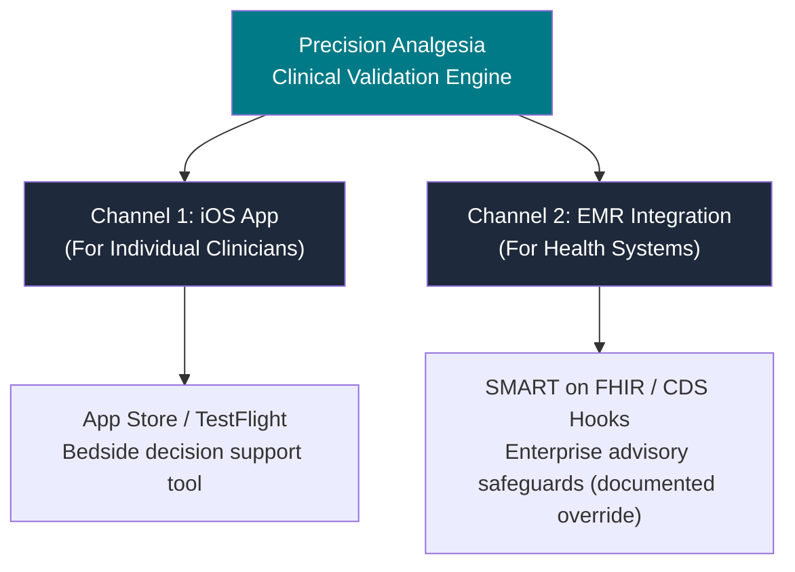
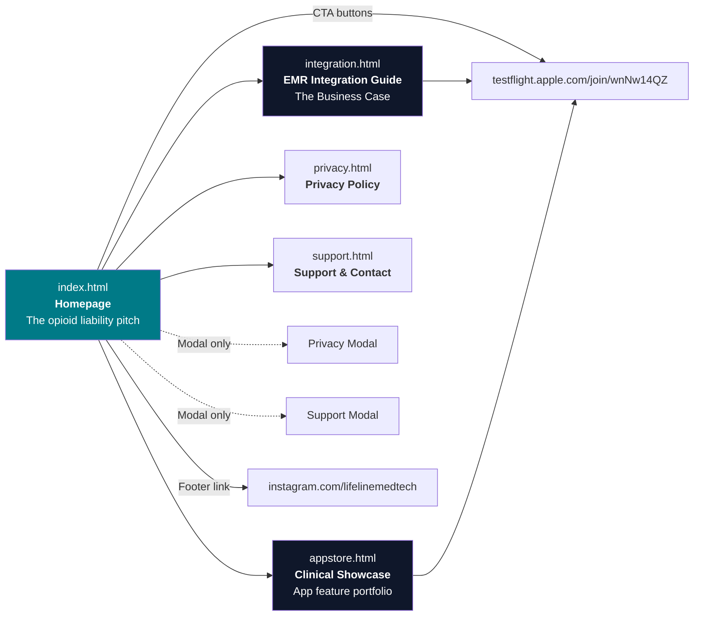

# Precision Analgesia — 10,000 Foot Site Overview

> [!NOTE]
> **Updated 2026-07-01.** Descriptions below were revised to match the corrected live site: "forcing function"/"hardwired" language was replaced with advisory-with-documented-override framing (REG-D), and the "$95B" burden figure was replaced with the sourced $78.5B/yr (Florence et al., *Medical Care* 2016). The previously cited "Asante Rogue verdict" claim was **retired 2026-07-01** — it was a 2024 *lawsuit* about criminal fentanyl diversion, unrelated to dosing CDS; see `Analgesia Precision EHR/Investor Materials/metrics_sheet.md`.

## The Core Product Story (What This Actually Is)

Lifeline Medical Technologies has built **one clinical algorithm** — a proprietary Clinical Validation Engine for inpatient opioid safety — and is delivering it through **two channels**:



| | **iOS App** | **EMR Integration** |
|---|---|---|
| **Audience** | Individual clinicians, residents, pharmacists | CMIOs, CFOs, IT leaders at health systems |
| **Value Prop** | Bedside calculator, risk scoring, OUD workflows | Advisory safety guidance inside Epic/Cerner, with a full audit trail of documented overrides |
| **Revenue Model** | Free (beta) → subscription/free? | Enterprise licensing |
| **Status** | In TestFlight beta | Prospective (needs hospital partner) |

---

## Current Site Map



### Pages Inventory

| Page | File | Purpose | Primary Audience |
|------|------|---------|-----------------|
| **Homepage** | [index.html](file:///Users/danielbergholz/Documents/Second%20Brain/02.%20General/08.%20LifelineMedTech/Analgesia%20Precision/Analgesia%20Precision%20Website/index.html) | Main landing — the opioid liability pitch ($78.5B economic burden, Florence 2016), logic engine overview, benchmarks table | Hospital executives, CMIOs |
| **EMR Integration** | [integration.html](file:///Users/danielbergholz/Documents/Second%20Brain/02.%20General/08.%20LifelineMedTech/Analgesia%20Precision/Analgesia%20Precision%20Website/integration.html) | Deep-dive enterprise pitch — business case, 6 clinical modules, SMART on FHIR architecture, 4-phase timeline | Hospital IT, CMIOs, CFOs |
| **Clinical Showcase** | [appstore.html](file:///Users/danielbergholz/Documents/Second%20Brain/02.%20General/08.%20LifelineMedTech/Analgesia%20Precision/Analgesia%20Precision%20Website/appstore.html) | iOS app feature portfolio with real screenshots organized by 3 clinical pillars | Clinicians via App Store link |
| **Privacy Policy** | [privacy.html](file:///Users/danielbergholz/Documents/Second%20Brain/02.%20General/08.%20LifelineMedTech/Analgesia%20Precision/Analgesia%20Precision%20Website/privacy.html) | Required for App Store — zero data collection policy | Apple Review, users |
| **Support** | [support.html](file:///Users/danielbergholz/Documents/Second%20Brain/02.%20General/08.%20LifelineMedTech/Analgesia%20Precision/Analgesia%20Precision%20Website/support.html) | Required for App Store — contact info, response time | Apple Review, users |

---

## What's Working Well ✅

1. **The enterprise pitch is strong.** The `integration.html` page is comprehensive — business case, capabilities, architecture, timeline, regulatory, and funding mechanism. This is genuinely investor/CMIO-grade content.

2. **Clinical credibility.** Every claim cites real sources (PRODIGY Trial / Khanna et al. 2020, CDC 2022, NCCN 2025, Florence et al. 2016). The "Glass Box" transparency positioning is compelling. *(An earlier version of the site and of this overview cited an "Asante Rogue verdict" — that claim was retired 2026-07-01; see `metrics_sheet.md`.)*

3. **The Showcase page is well-executed.** Real screenshots organized by clinical pillars with lightbox viewing. Honest, no fake ratings. Links to TestFlight work.

4. **SEO and social meta tags** are properly configured on the homepage with Open Graph, Twitter cards, and canonical URLs.

5. **Regulatory safe harbor** is clearly articulated across multiple pages.

---

## Critical Issues & Gaps 🔴

### 1. The Two Audiences Are Muddled

> [!IMPORTANT]
> The homepage opens with enterprise/executive language ("The Logic Layer for Inpatient Stewardship", "$78.5B economic burden", "EMR-integrated, advisory decision support") but the primary CTA is "Demo the iOS Beta." A CMIO won't download TestFlight. A resident looking for a calculator will bounce from the liability headline.

**The site doesn't clearly answer:** *"Is this a phone app I can use right now, or is this something my hospital needs to buy?"*

**Answer:** It's both — but the site never says that explicitly.

### 2. No "About the App" Section on the Homepage

The homepage has:
- ❌ No section explaining "there is an iOS app powered by this algorithm"
- ❌ No app screenshots on the homepage  
- ❌ No mention that clinicians can use this *today* via TestFlight
- ❌ The showcase page (`appstore.html`) is buried — only linked in the footer as "Clinical Showcase"

A visitor to the homepage sees enterprise infrastructure messaging but has no path to understanding the app exists, unless they click the small "Beta" button in the nav or scroll to the footer.

### 3. Navigation Is Incomplete

| From → To | Link Exists? | Notes |
|-----------|-------------|-------|
| Homepage → Integration | ✅ "View Integration Guide" CTA | Works |
| Homepage → Showcase | ⚠️ Footer only | Labeled "Clinical Showcase" — easy to miss |
| Homepage → Privacy | ✅ Modal (not page link) | The modal duplicates `privacy.html` content |
| Homepage → Support | ✅ Modal (not page link) | The modal duplicates `support.html` content |
| Integration → Homepage | ✅ | Works |
| Integration → Showcase | ❌ | No link at all |
| Showcase → Integration | ✅ | "EMR Integration Guide" button |
| Showcase → Homepage | ✅ | "Back to Home" link |

### 4. The Homepage Nav Links Are Anchor-Only

The desktop nav only has: `#impact`, `#solution`, `#benchmarks`. There's no link to the Integration page or Showcase page in the main navigation. The only way to reach these pages is:
- Integration: via the hero CTA button
- Showcase: via the footer

### 5. Duplicate Content (Modals vs. Pages)

The homepage has full modal popups for Privacy Policy and Support that contain essentially the same content as `privacy.html` and `support.html`. This creates maintenance burden — changes to one won't automatically apply to the other.

---

## Strategic Recommendations

### Recommendation 1: Add a Homepage Section for the iOS App

Insert a dedicated section between the Logic Engine and Benchmarks sections that:
- Shows 2-3 real app screenshots in phone frames
- Headline: "Available Now on iOS" or "Try It Today"
- Explains this is a standalone clinical tool powered by the same algorithm
- Links to: TestFlight beta AND the Clinical Showcase page
- Makes clear: "Individual clinicians can use this today. Health systems can integrate it into their EMR."

### Recommendation 2: Add Top-Level Navigation

Update the navbar on all pages to include persistent links:

```
[Logo] Precision Analgesia    |  The Problem  |  The App  |  EMR Integration  |  [Join Beta]
```

This gives both audiences a clear path:
- Clinicians → "The App" → Showcase page
- Executives → "EMR Integration" → Integration page

### Recommendation 3: Add a "Two Tracks" Explainer

Somewhere prominent (hero area or right below), add messaging like:

> **For Clinicians:** Download the iOS app to use evidence-based opioid safety tools at the bedside — today.
>
> **For Health Systems:** Integrate the same clinical logic directly into your EMR via SMART on FHIR and CDS Hooks.

### Recommendation 4: Link the Showcase from the Homepage (Beyond Footer)

The Showcase page is the promotional landing page for the App Store. It should be:
- Linked in the top navigation
- Mentioned in the hero area alongside "View Integration Guide"
- The page the App Store "Marketing URL" field points to

### Recommendation 5: Clean Up the Privacy/Support Duplication

Either:
- Remove the modals and link directly to the standalone pages, OR
- Remove the standalone pages and keep the modals (but the standalone pages are needed for App Store Connect URLs)

**Recommended:** Keep the standalone pages (required by Apple), update the footer to link to them, and remove the modal duplicates.

---

## File & Directory Structure

```
Analgesia Precision/
├── Analgesia Precision Website/       ← The Vercel-deployed website
│   ├── index.html                     ← Homepage (enterprise pitch)
│   ├── integration.html               ← EMR integration deep-dive
│   ├── appstore.html                  ← Clinical Showcase (App Store landing)
│   ├── privacy.html                   ← Privacy policy (App Store required)
│   ├── support.html                   ← Support page (App Store required)
│   ├── assets/                        ← CSS, images, screenshots, favicons
│   │   ├── marketing.compiled.css     ← Compiled Tailwind CSS
│   │   ├── screenshot_*.jpg           ← 9 real iOS app screenshots
│   │   ├── hero_product_mockup.png    ← Homepage hero image
│   │   └── ...                        ← Generated images, icons, docs
│   ├── src/                           ← React/TypeScript iOS app source
│   │   ├── OpioidPrecisionApp.tsx     ← Main app component
│   │   ├── CalculatorView.tsx         ← MME calculator
│   │   ├── AssessmentView.tsx         ← Risk assessment
│   │   └── ...                        ← Other clinical modules
│   ├── vercel.json                    ← Vercel config (cleanUrls, web-dist output)
│   ├── vite.config.ts                 ← Vite build config
│   └── package.json                   ← Build scripts, dependencies
│
├── Analgesia Precision iOS App/       ← Native iOS project (Xcode)
├── Assets/                            ← App Store screenshots, branding
├── Documentation/                     ← Pitch decks, metadata, outreach
│   ├── App_Store_Connect_Metadata.md  ← App Store listing copy
│   ├── Pitch_Deck_Outline.md          ← Investor pitch outline
│   └── ...
└── Code Backups/                      ← Version backups
```

---

## Open Questions for You

> [!IMPORTANT]
> These decisions will shape how I restructure the site:

1. **Pricing model for the iOS app?** The App Store metadata mentions it's free (no pricing schedule). Is the plan to keep it free forever, or move to a subscription model? This affects how we message it on the site.

2. **Is the domain `opioidprecision.com` live?** The canonical URL and OG tags point to `https://opioidprecision.com/` — is this the actual Vercel deployment domain?

3. **Homepage identity:** Should the homepage primarily be:
   - **(A)** An enterprise pitch page (current state) with the app mentioned as a secondary CTA?
   - **(B)** A balanced "product overview" that equally presents both the app and the EMR integration?
   - **(C)** A clinician-first page (app-focused) with enterprise integration as a secondary track?

4. **App Store Marketing URL:** The [App_Store_Connect_Metadata.md](file:///Users/danielbergholz/Documents/Second%20Brain/02.%20General/08.%20LifelineMedTech/Analgesia%20Precision/Documentation/App_Store_Connect_Metadata.md) has placeholder URLs (`https://[your-vercel-domain]/...`). Should we update these to point to the actual domain?

5. **Company branding:** The site says "Precision Analgesia" (product name) with "by Lifeline Medical Technologies" in the footer. Should the parent company have more presence, or is it intentionally product-branded?
